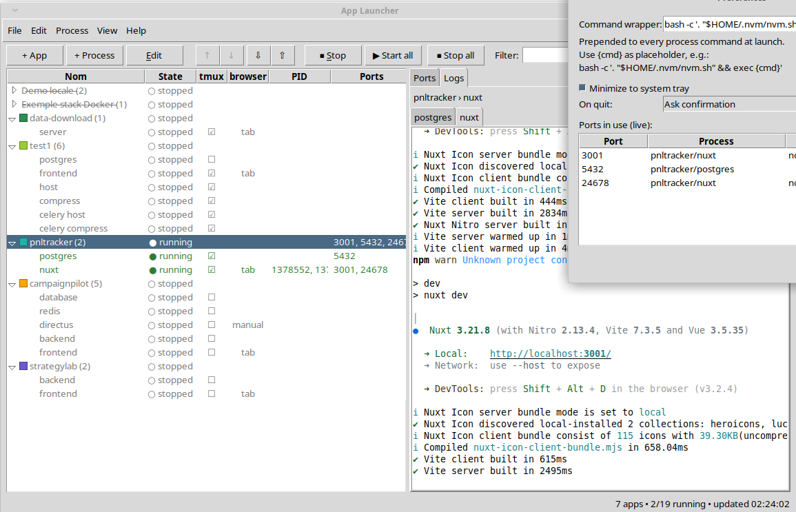

<p align="center">
  
</p>

# App Launcher

Desktop tool for Linux (Python + tkinter) to centralize start/stop
of local apps:
each app groups one or more processes (bash commands, `docker compose`,
`docker run`...), with live status, detected ports and per-process logs.

Processes can also run inside **tmux**: shared or dedicated sessions,
windows, panes and layouts, with terminal auto-attach — panes survive
a launcher restart and get re-adopted.

All your applications in one place: start them in one click without
digging through directories, see at a glance which ports are in use
and who owns them, open the app in your browser directly.

<p align="center">
  
</p>

## Run

```bash
pip install -r requirements.txt   # PyYAML + psutil + sv_ttk + pystray + Pillow
python3 applauncher.py
```

To launch it from your desktop menu instead, copy
[`applauncher.desktop`](applauncher.desktop) (example — fix the
`Exec`/`Icon` paths) to `~/.local/share/applications/`.

`docker` and `tmux` features turn on automatically when installed.

## Catalog (`apps.yaml`)

```yaml
apps:
  - name: "My app"
    url: "http://localhost:8000"        # optional (fallback browser target)
    processes:
      - name: "api"
        cmd: "python3 -m http.server 8000"
        workdir: "/tmp"                  # optional
        stop: ""                         # custom stop command (optional)
        ports: [8000]                    # expected ports (optional)
        docker: false                    # true if cmd spawns containers
        tmux: false                      # true to spawn inside a tmux session
```

Editable from the GUI (double-click / Edit button / right-click) or by
hand; saved back to the same file.

## Features

- **Start / stop / restart** per app (all its processes) or per process
  (toolbar toggle, context menu, keyboard-free double-click editing).
- **Process states**: running / partial / external (started outside the
  tool) / finished / stopped. Docker processes are matched against
  `docker ps` by compose `workdir` label **or** process name in the
  container name — no port probing needed.
- **tmux spawning** (`tmux: true`): one session per app (`al-<app>`);
  `tmux_window: N` selects the window index — processes sharing it
  become panes of that window (`tmux_layout` sets the split style).
  Attach via the context menu ("Attach") or `tmux attach -t al-<app>`.
  Panes survive launcher restarts and are re-adopted.
- **Ports**: auto-detected per process (PID tree via psutil) + docker
  host ports. Ports tab = whole machine, tagged with the owning app.
- **Logs**: per-process files + launcher diagnostics — see *Logs*.
- **Browser launch**: dropdown (Firefox/Brave, persisted). Per-process
  `browser_mode` (`window`/`tab`/`none` — 'none' hides its Open entries).
  App menu "Open URLs" and the Launch button open every app URL
  (`url`, `launch_port`, each process port) in its own mode; tabs are
  opened in the most recently used browser window (X11 stacking).
- **Themes**: Sun Valley dark/light + native ttk themes, switchable at
  runtime, persisted.
- **System tray**: minimize to tray, restore/quit from the icon menu.
  Hardened quit path (stop deadline + watchdogs) so the app always exits.

## Config

- `--config <path>` / `APPLAUNCHER_CONFIG` — pick another catalog file.
- Default catalog: `./apps.yaml` next to the script, else
  `~/.config/applauncher/apps.yaml` — personal, gitignored.

## Logs

- `logs/<app>/<proc>.log` — per-process logs; the **Logs** tab
  browses/clears them.
- `logs/applauncher.log` — launcher diagnostics; *View > Launcher
  log* shows it live.
- `--logs-dir` / `APPLAUNCHER_LOGS` — change where logs go.

## Preferences

`~/.config/applauncher/prefs.json` — GUI preferences (browser,
theme, URL base, min window size, tray, quit action, command
wrapper), editable via the Preferences dialog.

## Notes / limits

- Foreground `docker run` without `--rm`/`stop`: killing the client may
  leave the container — declare `stop` or use `docker: true` (container
  stop via `docker ps` matching).
- Processes owned by other users may appear without PIDs (psutil perms).
- tmux sessions keep running after the launcher exits unless stopped.
